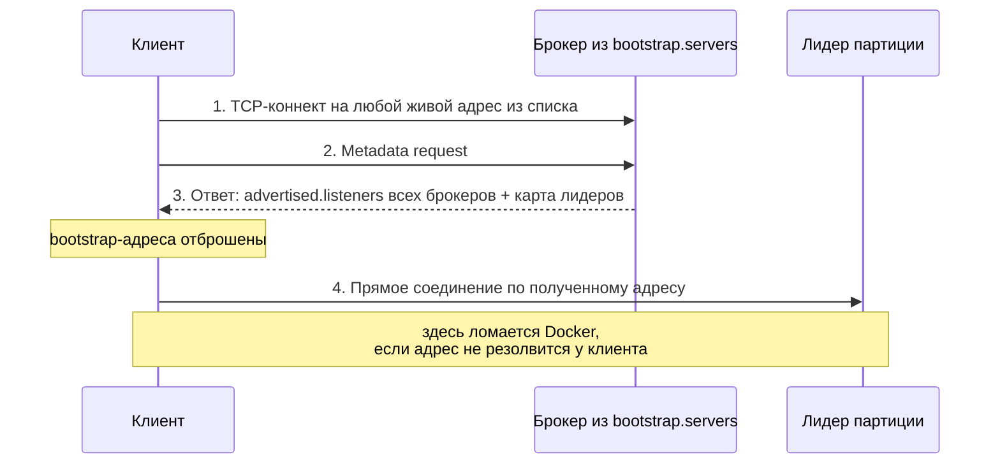

# Модуль 0. Окружение и запуск Kafka

**Версия:** Kafka 4.x (KRaft, без ZooKeeper)
**Время:** 2–4 часа теории, 3–4 часа практики
**Документация:** [Quickstart](https://kafka.apache.org/quickstart), [KRaft](https://kafka.apache.org/documentation/#kraft), [Broker Configs](https://kafka.apache.org/documentation/#brokerconfigs)

---

Модуль 0 обычно проскакивают за час, а потом три недели спотыкаются о вещи, которые нужно было понять именно здесь. Основные из них: почему клиент подключается, но не работает; почему брокер «запустился», но не принимает трафик; и что такое `cluster.id`.

## Содержание

1. [Брокер на уровне процесса](#1-брокер-на-уровне-процесса)
2. [KRaft: где живут метаданные](#2-kraft-где-живут-метаданные)
3. [Форматирование хранилища](#3-форматирование-хранилища)
4. [Listeners: главная тема модуля](#4-listeners-главная-тема-модуля)
5. [Дистрибутивы и способы запуска](#5-дистрибутивы-и-способы-запуска)
6. [Что лежит на диске](#6-что-лежит-на-диске)
7. [Последовательность старта брокера](#7-последовательность-старта-брокера)
8. [Диагностика](#8-диагностика)
9. [Практика](#9-практика)
10. [Контрольные вопросы](#10-контрольные-вопросы)

---

## 1. Брокер на уровне процесса

Брокер Kafka — обычный JVM-процесс (`kafka.Kafka`), который делает три вещи: слушает TCP-порты, пишет байты в файлы на диске и отвечает на запросы по бинарному протоколу Kafka.

Что из этого следует практически:

**HTTP тут нет.** Ни REST, ни JSON. Общение идёт по бинарному протоколу поверх TCP. Всё, что выглядит как REST — Schema Registry, Kafka Connect, REST Proxy — это отдельные сервисы рядом с брокером, а не его часть. Если вы пытаетесь `curl`-ом достучаться до порта 9092, вы делаете что-то не то.

**Нет отдельного сервера метаданных.** С версии 4.0 ZooKeeper удалён полностью. Метаданные живут внутри самой Kafka.

**Состояние — на диске в `log.dirs`.** Брокер почти не держит данные партиций в собственной куче: он полагается на страничный кэш операционной системы. Отсюда стандартная рекомендация давать JVM heap 6–8 ГБ, а всю остальную память оставлять ОС. Задаётся через `KAFKA_HEAP_OPTS`. Попытка «дать Kafka побольше памяти», увеличив heap до 60 ГБ, обычно делает только хуже: вы отбираете память у page cache и получаете длинные паузы GC.

Одна нода в KRaft может исполнять роли `broker`, `controller` или обе сразу через `process.roles=broker,controller`. Совмещённый режим годится только для разработки, и стоит понимать почему:

- контроллер и брокер конкурируют за одни и те же CPU и диск;
- их нельзя обновлять независимо;
- отказ процесса уносит обе функции сразу;
- нагрузка на брокер (репликация, тяжёлые консьюмеры) может замедлить обработку метаданных.

## 2. KRaft: где живут метаданные

Метаданные кластера — какие есть топики, сколько партиций, кто лидер, какие реплики в ISR, какие настроены ACL — хранятся во внутреннем топике `__cluster_metadata` с единственной партицией. Этот топик реплицируется между контроллерами по протоколу Raft.

Ключевая идея, которую стоит удержать: **метаданные — это лог событий, а не дерево состояния.**

В эпоху ZooKeeper контроллер при старте вычитывал полное дерево znode и рассылал брокерам полную картину. Каждое изменение означало запись в ZK плюс рассылку. При большом числе партиций смена контроллера занимала минуты.

Сейчас брокер подписывается на лог метаданных и применяет записи по порядку, держа актуальный снапшот в памяти. Отсюда быстрый failover контроллера (новый лидер Raft уже имеет весь лог) и способность работать с сильно большим числом партиций.

Из кворума контроллеров один является лидером Raft — это **active controller**. Остальные держат полную копию лога и служат горячим резервом. Кворум обычно состоит из 3 или 5 нод: чтобы принять запись, нужно большинство, поэтому 3 контроллера переживают отказ одного, 5 — отказ двух.

Состав кворума задаётся одним из двух способов:

| Настройка | Тип | Изменение состава |
|---|---|---|
| `controller.quorum.voters` | статический список `1@host:9093,2@...` | требует перезапуска всех нод |
| `controller.quorum.bootstrap.servers` | динамический кворум (KIP-853) | `kafka-metadata-quorum.sh add-controller` на живом кластере |

Динамический вариант — то, что нужно в проде. Статический проще для учебного окружения, и именно он используется в нашем compose.

## 3. Форматирование хранилища

Брокер отказывается стартовать на неотформатированном каталоге. Последовательность:

```bash
# 1. Сгенерировать идентификатор кластера
KAFKA_CLUSTER_ID=$(bin/kafka-storage.sh random-uuid)

# 2. Отформатировать хранилище
bin/kafka-storage.sh format -t "$KAFKA_CLUSTER_ID" -c config/server.properties

# 3. Только теперь запускать
bin/kafka-server-start.sh config/server.properties
```

Что при этом происходит: создаётся структура каталогов в `log.dirs` и пишется файл `meta.properties` с `cluster.id`, `node.id` и версией формата. Для нод с ролью контроллера дополнительно инициализируется bootstrap-чекпоинт лога метаданных.

### Зачем это отдельный шаг, а не автоматика

`cluster.id` — защита от смешивания кластеров. Если брокер стартует и обнаруживает, что `cluster.id` в его `meta.properties` не совпадает с тем, что говорит кворум, он падает с `InconsistentClusterIdException` вместо того, чтобы тихо присоединиться к чужому кластеру и начать реплицировать чужие данные.

Это ровно тот класс ошибок, который в проде стоит очень дорого: представьте ноду, которую по ошибке подняли с конфигом от соседнего кластера. Явное форматирование делает такую ситуацию невозможной.

Полезные флаги `kafka-storage.sh format`:

- `--standalone` — одиночный контроллер с динамическим кворумом;
- `--initial-controllers` — начальный состав динамического кворума;
- `--ignore-formatted` — не падать, если каталог уже отформатирован (используется в Docker-образах).

Официальный образ `apache/kafka` делает `format` за вас при первом старте, если передан `CLUSTER_ID`. Уберите эту переменную из compose и посмотрите на ошибку — это полезнее, чем прочитать про неё.

### Feature levels

Отдельная тема на будущее: `metadata.version`. Это feature level кластера, версия формата метаданных, которая управляется через `kafka-features.sh` и повышается вручную после обновления бинарников.

Запомнить сейчас нужно одно: **«обновить Kafka» и «обновить формат метаданных» — два разных действия.** Разнесение их во времени и есть механизм безопасного отката при апгрейде.

## 4. Listeners: главная тема модуля

Здесь ломается больше окружений, чем на всём остальном вместе взятом. Разберём механику до конца.

### Четыре настройки

| Настройка | Что означает |
|---|---|
| `listeners` | что брокер **биндит**. Про сокеты: `NAME://host:port`. Пустой host = все интерфейсы |
| `advertised.listeners` | что брокер **сообщает клиентам** в ответе на Metadata request. Про то, как до него достучаться снаружи |
| `listener.security.protocol.map` | сопоставление имени listener'а с протоколом: `PLAINTEXT`, `SSL`, `SASL_PLAINTEXT`, `SASL_SSL` |
| `inter.broker.listener.name` / `controller.listener.names` | какие listener'ы используются для репликации между брокерами и для Raft-трафика |

Имена вроде `INTERNAL` и `EXTERNAL` вы придумываете сами, но каждое обязано присутствовать в `listener.security.protocol.map`. Контроллерный listener не должен попадать в `advertised.listeners`: клиенты по нему не ходят.

### Как клиент на самом деле подключается



Из этой последовательности следует всё остальное.

**`bootstrap.servers` нужен ровно для первого рукопожатия.** Дальше клиент выбрасывает эти адреса и работает по тем, что получил в метаданных. Поэтому классический симптом неверной конфигурации выглядит парадоксально: подключение как будто устанавливается, а потом всё виснет и падает по таймауту.

В логах клиента вы увидите характерную картину: `node -1` (так обозначается bootstrap-соединение) отработал, а `node 1`, `node 2` не отвечают.

### Почему ломается Docker

Внутри compose-сети имя `kafka` резолвится через встроенный DNS. С хоста — нет. Один набор advertised-адресов не может обслужить оба сценария, поэтому нужны **два listener'а на разных портах**: один анонсирует `kafka:19092` для контейнеров, другой `localhost:9092` для хоста.

Именно так устроен `docker/compose.single.yml` в этом репозитории:

```yaml
KAFKA_LISTENERS: INTERNAL://:19092,EXTERNAL://:9092,CONTROLLER://:9093
KAFKA_ADVERTISED_LISTENERS: INTERNAL://kafka:19092,EXTERNAL://localhost:9092
KAFKA_LISTENER_SECURITY_PROTOCOL_MAP: INTERNAL:PLAINTEXT,EXTERNAL:PLAINTEXT,CONTROLLER:PLAINTEXT
KAFKA_INTER_BROKER_LISTENER_NAME: INTERNAL
KAFKA_CONTROLLER_LISTENER_NAMES: CONTROLLER
```

Второй нюанс: в `advertised.listeners` для внешнего listener'а должен стоять **опубликованный порт хоста**, а не внутренний порт контейнера. Если вы пробросили `9092:9092`, но в advertised указали `19092`, клиент получит адрес `localhost:19092`, на котором никто не слушает.

### Типичные ошибки конфигурации

| Ошибка | Симптом |
|---|---|
| listener есть в `advertised.listeners`, но нет в `listeners` | брокер не стартует |
| имя listener'а отсутствует в `listener.security.protocol.map` | брокер не стартует |
| контроллерный listener попал в `advertised.listeners` | клиенты пытаются ходить на Raft-порт |
| два listener'а на одном порту | `Each listener must have a different port` |
| в advertised указано имя контейнера, клиент на хосте | коннект проходит, дальше таймауты на `node 1..N` |
| порт в advertised не совпадает с проброшенным | то же самое, но с `Connection refused` |

## 5. Дистрибутивы и способы запуска

### Архив с kafka.apache.org

Внутри `bin/`, `config/`, `libs/`. Требования по Java для 4.x: JDK 17 и выше для брокера, Connect и утилит; клиентские библиотеки и Streams довольствуются Java 11. Практически — ставьте 21.

Скрипты в `bin/`, которые понадобятся по ходу роадмапа:

| Скрипт | Модуль |
|---|---|
| `kafka-storage.sh` | 0 — форматирование |
| `kafka-server-start.sh` / `-stop.sh` | 0 |
| `kafka-broker-api-versions.sh` | 0 — проверка доступности |
| `kafka-topics.sh` | 2 |
| `kafka-console-producer.sh` / `-consumer.sh` | 2 |
| `kafka-dump-log.sh` | 2 — разбор сегментов |
| `kafka-get-offsets.sh` | 2, 4 |
| `kafka-consumer-groups.sh` | 4 — группы и lag |
| `kafka-configs.sh` | 2, 7 — динамические конфиги и квоты |
| `kafka-metadata-quorum.sh` | 7 — состояние кворума |
| `kafka-features.sh` | 7 — feature levels |
| `kafka-reassign-partitions.sh` | 7 — перебалансировка |
| `kafka-leader-election.sh` | 7 |
| `kafka-log-dirs.sh` | 7, 8 |
| `kafka-producer-perf-test.sh` / `kafka-consumer-perf-test.sh` | 8 |
| `kafka-acls.sh` | 9 |
| `kafka-transactions.sh` | 6 |

### Образы

| Образ | Особенности |
|---|---|
| `apache/kafka` | официальный, на JVM |
| `apache/kafka-native` | GraalVM native-image: стартует за доли секунды, ест меньше памяти. Удобен для тестов и CI |
| `confluentinc/cp-kafka` | сборка Confluent со своей обвязкой |

В официальном образе конфигурация задаётся переменными вида `KAFKA_<ИМЯ>`: имя переводится в нижний регистр, подчёркивания становятся точками.

```
KAFKA_NUM_PARTITIONS              -> num.partitions
KAFKA_LOG_RETENTION_HOURS         -> log.retention.hours
KAFKA_AUTO_CREATE_TOPICS_ENABLE   -> auto.create.topics.enable
```

Это позволяет задать любой параметр из документации без сборки своего образа.

## 6. Что лежит на диске

В `log.dirs`:

```
/var/lib/kafka/data/
├── meta.properties                       # cluster.id, node.id, версия формата
├── __cluster_metadata-0/                 # лог метаданных (только на контроллерах)
├── labs.orders.created.v1-0/
│   ├── 00000000000000000000.log          # сами записи
│   ├── 00000000000000000000.index        # индекс оффсет -> позиция в файле
│   ├── 00000000000000000000.timeindex    # индекс timestamp -> оффсет
│   ├── leader-epoch-checkpoint
│   └── partition.metadata
├── recovery-point-offset-checkpoint
├── replication-offset-checkpoint
└── cleaner-offset-checkpoint
```

Сейчас достаточно зайти внутрь и посмотреть глазами. Детально сегменты разбираются в модуле 2 через `./kl dump`.

## 7. Последовательность старта брокера

Порядок важен, потому что объясняет, почему брокер иногда «запустился», но трафик не принимает:

1. Читает конфиг и `meta.properties`, сверяет `cluster.id` и `node.id`.
2. Поднимает Raft-клиент, находит кворум контроллеров.
3. **Восстанавливает лог**: проверяет незакрытые сегменты. При некорректном завершении процесса это может занять заметное время, пропорциональное объёму данных.
4. Регистрируется в контроллере (BrokerRegistration).
5. Находится в состоянии **fenced** — зарегистрирован, но не обслуживает партиции — пока не догонит лог метаданных. После этого переходит в unfenced.
6. Начинает принимать запросы, становится лидером или фолловером своих партиций.

Отсюда практическое правило: `docker ps` показывает `Up`, healthcheck ещё не прошёл, а брокер уже принимает TCP-соединения и может отвечать `NOT_CONTROLLER` или `LEADER_NOT_AVAILABLE`. Поэтому `./kl up cluster` ждёт статуса healthy, а не просто возвращает управление после `docker compose up -d`.

## 8. Диагностика

Инструменты, закрывающие большинство вопросов на этом этапе:

```bash
./kl shell
# внутри контейнера:
/opt/kafka/bin/kafka-broker-api-versions.sh --bootstrap-server localhost:29092
/opt/kafka/bin/kafka-metadata-quorum.sh --bootstrap-server localhost:29092 describe --status
/opt/kafka/bin/kafka-metadata-quorum.sh --bootstrap-server localhost:29092 describe --replication
```

`kafka-broker-api-versions.sh` особенно полезен тем, что показывает, **до кого клиент реально достучался**. Если он выводит адрес `kafka:19092`, а вы запускаете его с хоста — вот вам и ответ про advertised.

`describe --status` показывает лидера кворума (active controller), высокую водяную отметку лога метаданных и отставание каждого голосующего.

Логи брокера:

| Файл | Содержимое |
|---|---|
| `server.log` | общий поток |
| `controller.log` | Raft и решения контроллера |
| `state-change.log` | смены лидеров партиций |

В Docker всё это смешано в stdout контейнера, доступно через `./kl logs`.

## 9. Практика

Порядок экспериментов:

1. **Ручной запуск.** Скачать архив, отформатировать хранилище, запустить брокер, подключиться консольным консьюмером. Цель — увидеть все три шага руками.
2. **Docker.** `./kl up single`, подключиться с хоста, убедиться, что работает.
3. **Сломать advertised.** Поменять внешний advertised-адрес на `kafka:9092`, перезапустить, попробовать подключиться с хоста. Прочитать ошибку целиком и объяснить её себе, не подглядывая в этот документ.
4. **Убрать `CLUSTER_ID`.** Поднять с чистым томом, посмотреть на поведение.
5. **Кластер.** `./kl up cluster`, посмотреть `describe --replication`, определить active controller.
6. **Убить контроллер.** `./kl chaos kill-broker 1` и посмотреть, как меняется лидер кворума.
7. Заполнить `notes/00-setup.md`.

## 10. Контрольные вопросы

Если не можете ответить письменно и без подглядывания — модуль не закрыт.

1. Что такое `cluster.id`, где он хранится и от какой ошибки защищает?
2. Чем `listeners` отличается от `advertised.listeners`? Приведите конфигурацию, при которой брокер стартует, но клиент с хоста работать не сможет.
3. Опишите по шагам, что делает клиент от вызова `new KafkaProducer(props)` до первой успешной записи. В какой момент `bootstrap.servers` перестаёт использоваться?
4. Почему совмещённый режим `broker,controller` не рекомендуется в проде? Назовите три причины.
5. Что произойдёт при потере большинства контроллеров? Смогут ли клиенты продолжить читать и писать?
6. Почему Kafka рекомендуют небольшой heap и много свободной памяти в системе?
7. Что означает состояние fenced у брокера и почему `docker ps: Up` не означает готовность?

---

## Дальше

- Модуль 1: концепции event streaming, зачем нужен лог как абстракция
- Модуль 2: топики, партиции, сегменты, retention и compaction — фундамент, на котором стоит всё остальное
