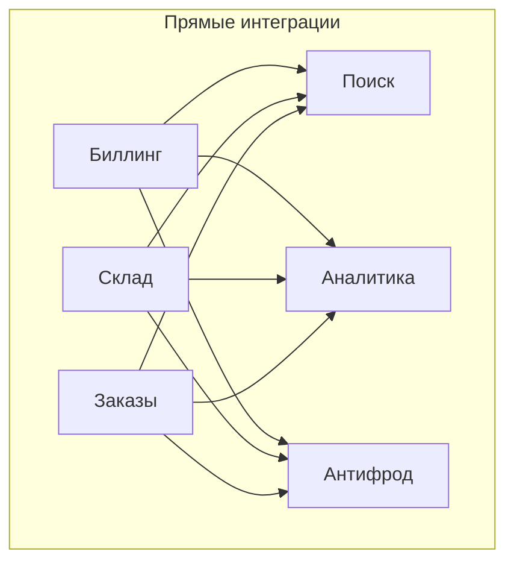
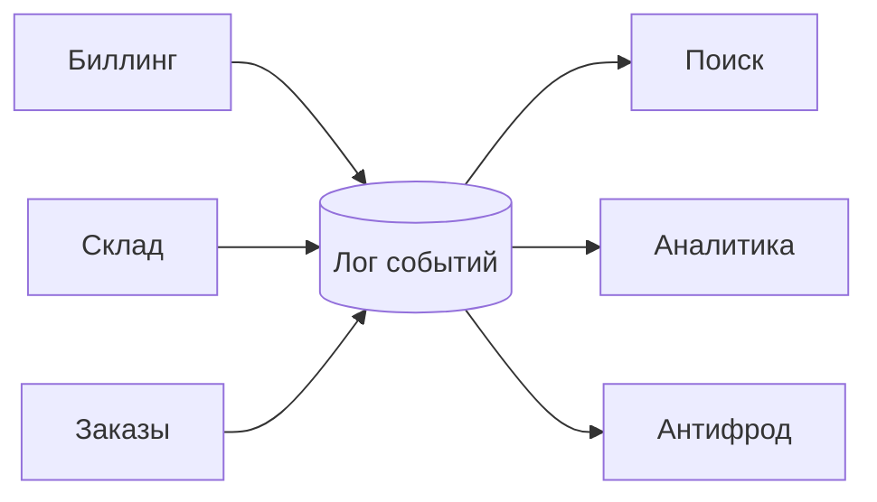
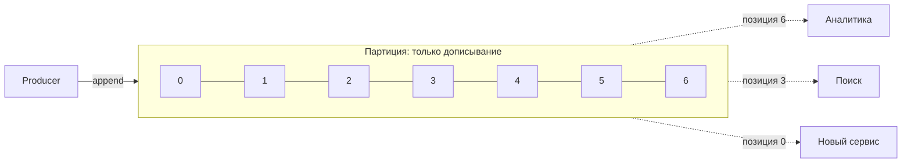

# Модуль 1. Лог как абстракция: что такое Kafka и когда она не нужна

**Время:** 4–6 часов
**Документация:** [Introduction](https://kafka.apache.org/documentation/#introduction), [Use cases](https://kafka.apache.org/documentation/#uses), [Design](https://kafka.apache.org/documentation/#design)

---

Модуль обзорный, но не проходной. Половина плохих архитектурных решений с Kafka вырастает из неверной ментальной модели, заложенной в самом начале: человек думает про очередь сообщений и потом годами удивляется, почему всё не так.

Задача модуля — заложить правильную модель и, что не менее важно, очертить границы применимости. Раздел «когда Kafka плохой выбор» здесь не формальность: умение сказать «эта задача не про Kafka» отличает senior-инженера от того, кто выучил API.

## Содержание

1. [Задача, которую решает Kafka](#1-задача-которую-решает-kafka)
2. [Три неверные модели](#2-три-неверные-модели)
3. [Лог как структура данных](#3-лог-как-структура-данных)
4. [Дуализм потока и таблицы](#4-дуализм-потока-и-таблицы)
5. [Почему это быстро](#5-почему-это-быстро)
6. [Pull вместо push](#6-pull-вместо-push)
7. [Чего Kafka не делает](#7-чего-kafka-не-делает)
8. [Сравнение с альтернативами](#8-сравнение-с-альтернативами)
9. [Когда Kafka плохой выбор](#9-когда-kafka-плохой-выбор)
10. [Карта экосистемы](#10-карта-экосистемы)
11. [Практика](#11-практика)
12. [Контрольные вопросы](#12-контрольные-вопросы)

---

## 1. Задача, которую решает Kafka

Начните не с технологии, а с проблемы, иначе смысл ускользнёт.

В компании есть системы: биллинг, склад, поиск, аналитика, рекомендации, антифрод, хранилище данных. Каждой нужны данные каждой. Если соединять их напрямую, число интеграций растёт как произведение: десять источников и десять потребителей дают до ста соединений, каждое со своим форматом, своим расписанием, своим владельцем и своей поломкой.



Каждая стрелка — это код, договорённость о формате, мониторинг и человек, который её чинит. Добавление одиннадцатой системы означает десять новых стрелок.

Идея Kafka: поставить в центр **лог событий**, в который источники пишут, а потребители читают независимо друг от друга.



Число связей становится линейным. Но выигрыш не только в арифметике, и это важнее:

**Развязка во времени.** Потребитель может быть выключен сутки и потом догнать. Источнику всё равно.

**Развязка в осведомлённости.** Источник не знает, кто его читает. Новый потребитель добавляется без изменений в источнике — и это ключевое свойство, ради которого всё затевается.

**Воспроизводимость.** Данные не исчезают после чтения. Новый сервис может прочитать историю с начала и построить своё состояние. Сломавшийся сервис может переиграть события после починки.

**Единый порядок.** Внутри партиции события упорядочены и этот порядок одинаков для всех читателей. При прямых интеграциях два потребителя легко видят события в разном порядке.

Последний пункт — то, что делает лог не просто транспортом, а **источником истины**. Об этом стоит думать так: лог — это журнал того, что произошло, а базы данных потребителей — производные представления, которые всегда можно пересобрать.

---

## 2. Три неверные модели

Прежде чем строить правильную модель, стоит явно отбросить три неправильные. Каждая из них выглядит правдоподобно и каждая приводит к типовым ошибкам.

### «Kafka — это очередь сообщений»

Что подсказывает эта модель: сообщение приходит, потребитель его забирает, сообщение исчезает. Хотите быстрее — добавьте потребителей.

Что не так:

- чтение ничего не удаляет, данные лежат до истечения retention;
- позицию чтения хранит потребитель, а не брокер;
- добавить потребителей сверх числа партиций бесполезно — они будут простаивать;
- нет подтверждения отдельного сообщения, есть только сдвиг позиции;
- нет приоритетов и нет отложенной доставки.

Отсюда типичная ошибка: команда делает на Kafka очередь заданий с неравномерным временем обработки, упирается в то, что одна медленная запись блокирует всю партицию, и начинает изобретать обходные пути.

Оговорка: в Kafka 4.x появились share groups (KIP-932), которые дают именно очередную семантику с подтверждением отдельных записей. Это отдельный инструмент со своими компромиссами, разбираем в модуле 13. Но по умолчанию Kafka — не очередь.

### «Kafka — это база данных»

Что подсказывает: раз данные хранятся, можно спросить «дай мне заказ №12345».

Что не так: у лога нет произвольного доступа по ключу. Единственный способ найти запись — прочитать партицию с некоторой позиции и просмотреть подряд. Compacted-топики частично меняют картину, но это по-прежнему не индекс.

Отсюда ошибка: Kafka используют как основное хранилище и потом строят поверх костыли, реализующие то, что база даёт из коробки.

### «Kafka — это шина, замена ESB»

Что подсказывает: положим в центр умную шину, которая маршрутизирует, трансформирует и обогащает.

Что не так: брокер Kafka принципиально глуп. Он не знает формата сообщений, не маршрутизирует по содержимому, не преобразует. Вся логика живёт в клиентах. Это осознанное решение, оно и позволяет брокеру быть быстрым и предсказуемым.

Отсюда ошибка: бизнес-логику тащат в Connect SMT и в конфигурацию, получая невидимую для тестов и отладки часть системы.

---

## 3. Лог как структура данных

Правильная модель проста до неприличия.

**Лог — это упорядоченная, только дописываемая, неизменяемая последовательность записей.** У каждой записи есть порядковый номер — оффсет. Всё.



Из этого определения выводится почти всё поведение Kafka:

**Запись только в конец** — значит нет случайной записи, нет блокировок при вставке в середину, нет фрагментации. Отсюда производительность.

**Неизменяемость** — значит запись, однажды принятую, нельзя отредактировать. Исправление выражается новой записью. Это меняет способ моделирования: вместо «обновить статус заказа» вы пишете «статус заказа изменился на X».

**Оффсет как позиция чтения** — значит состояние потребителя это одно число. Отсюда возможность переиграть историю: достаточно сдвинуть число назад. Отсюда же независимость потребителей: три сервиса на диаграмме читают одни данные, находясь в разных местах, и не мешают друг другу.

**Отсутствие удаления при чтении** — значит время жизни записи определяется политикой (`retention.ms`, `retention.bytes`, compaction), а не тем, кто её прочитал.

### Партиции: где ломается простота

Лог, описанный выше, живёт на одной машине и упорядочен целиком. Чтобы масштабироваться, топик делится на партиции — независимые логи, распределённые по брокерам.

Цена за масштабирование: **глобального порядка в топике нет.** Порядок гарантирован только внутри партиции. Это не деталь реализации, а фундаментальное свойство, с которым вы будете иметь дело постоянно.

Отсюда роль ключа сообщения: записи с одинаковым ключом попадают в одну партицию, значит их взаимный порядок сохраняется. Выбор ключа — это выбор того, что именно вы хотите упорядочить. Заказы по `orderId` — порядок событий одного заказа. По `userId` — порядок событий одного пользователя, но события разных заказов одного пользователя окажутся связаны.

Детально разбираем в модуле 2, здесь важно уложить принцип: **ключ определяет единицу порядка, а не единицу хранения.**

---

## 4. Дуализм потока и таблицы

Идея, которая понадобится в модуле 12, но заложить её стоит сейчас.

Поток событий и таблица состояний — два представления одних данных.

Возьмите последовательность:

```
key=user-1  balance=100
key=user-1  balance=150
key=user-2  balance=70
key=user-1  balance=120
```

Как **поток** это четыре события: было столько, стало столько. Как **таблица** это текущее состояние: `user-1 → 120`, `user-2 → 70`.

Переход в обе стороны:

- поток → таблица: свернуть события по ключу, оставив последнее (это ровно то, что делает log compaction);
- таблица → поток: журнал изменений таблицы (это ровно то, что делает CDC).

Практический вывод: compacted-топик — это способ хранить в Kafka таблицу. Не полноценную базу, но материализованное представление «последнее значение по каждому ключу». На этом стоят Kafka Streams state stores, Connect offsets, `__consumer_offsets` и Schema Registry.

---

## 5. Почему это быстро

Вопрос звучит парадоксально: Kafka пишет каждое сообщение на диск и при этом обгоняет решения, держащие данные в памяти. Причин четыре, и все они про то, чтобы **не делать лишнего**.

### Последовательный доступ вместо случайного

Диск медленный при случайном доступе и быстрый при последовательном — разница на порядки, и на HDD она драматична, но сохраняется и на SSD. Документация Kafka приводит замеры, где последовательная запись даёт сотни мегабайт в секунду против сотен килобайт при случайной на том же массиве.

Append-only лог по построению использует только последовательный доступ.

### Страничный кэш вместо своего

Kafka не строит собственный кэш в куче JVM. Она пишет в файл, а операционная система сама держит горячие страницы в памяти. Следствия:

- нет дублирования данных (в куче и в page cache одновременно);
- нет давления на сборщик мусора от больших объёмов;
- кэш переживает перезапуск процесса.

Отсюда рекомендация из модуля 0: маленький heap, много свободной памяти системе.

### Zero-copy при отдаче

Обычная отправка файла в сеть — это четыре копирования и два переключения контекста: диск → ядро → приложение → ядро → сетевая карта. Системный вызов `sendfile` позволяет отдать данные из страничного кэша прямо в сокет, минуя пространство приложения.

Kafka этим пользуется, потому что не трогает содержимое сообщений — она их не разбирает и не преобразует. Тот факт, что брокер «глупый», здесь окупается напрямую.

Важная деталь: zero-copy ломается, если брокеру приходится перепаковывать батчи — например, при несовпадении версий формата или при некоторых конфигурациях сжатия.

### Батчинг и сжатие

Producer не отправляет сообщения по одному: он накапливает батч и шлёт его целиком. Сжатие применяется к батчу, а не к отдельной записи, что даёт заметно лучший коэффициент на однородных данных. Батч хранится сжатым на диске и передаётся сжатым потребителю — распаковка происходит на клиенте.

Это объясняет неинтуитивный эффект из модуля 3: увеличение `linger.ms`, то есть добавление искусственной задержки, часто **улучшает** и пропускную способность, и задержку под нагрузкой.

---

## 6. Pull вместо push

Брокер не проталкивает данные потребителю. Потребитель сам запрашивает следующую порцию.

Почему так:

**Потребитель сам управляет темпом.** Медленный потребитель не захлёбывается, ему не нужен отдельный протокол backpressure. Он просто реже спрашивает.

**Батчинг возможен на чтении.** При push брокер вынужден либо слать по одному, либо гадать, сколько потребитель осилит.

**Переигрывание бесплатно.** Раз потребитель управляет позицией, «прочитать снова со вчера» — это просто другой номер в запросе.

Цена: при отсутствии данных потребитель опрашивает впустую. Решается long polling — брокер придерживает ответ до появления данных или до таймаута (`fetch.max.wait.ms`).

---

## 7. Чего Kafka не делает

Список важнее, чем кажется. Каждый пункт — это либо архитектурное ограничение, либо задача, которую придётся решать самому.

| Нет | Что это значит на практике |
|---|---|
| Глобального порядка в топике | порядок только внутри партиции; кросс-партиционные инварианты придётся обеспечивать иначе |
| Приоритетов сообщений | нельзя «пропустить срочное вперёд»; делается отдельными топиками |
| Отложенной доставки | нет «доставить через час»; делается retry-топиками с задержкой или внешним планировщиком |
| Подтверждения отдельного сообщения | коммитится позиция, а не запись (кроме share groups) |
| Выборочного удаления | нельзя удалить одну запись; только retention, compaction или запись-надгробие |
| Поиска по содержимому | нет индексов, нет запросов; только чтение подряд с позиции |
| Транзакций с внешними системами | EOS работает внутри Kafka; для БД нужен outbox или дедупликация |
| Маршрутизации по содержимому | брокер не смотрит внутрь сообщения |
| Гарантии отсутствия дублей у потребителя | at-least-once по умолчанию; идемпотентность обработчика — ваша задача |

Отдельно про exactly-once. Формулировка «Kafka поддерживает exactly-once» верна с существенной оговоркой: это работает для конвейера чтение-обработка-запись **внутри Kafka**. Как только в цепочке появляется база данных или внешний HTTP-вызов, гарантия заканчивается и требуется другой механизм. Подробно в модуле 6.

---

## 8. Сравнение с альтернативами

| | Kafka | RabbitMQ | Redis Streams | Pulsar | SQS |
|---|---|---|---|---|---|
| Модель | распределённый лог | брокер очередей с маршрутизацией | лог в памяти с персистентностью | лог с разделением вычислений и хранения | управляемая очередь |
| Хранение после чтения | да, по retention | нет | да, по MAXLEN | да, многоуровневое | нет |
| Переигрывание | да | нет | да | да | нет |
| Порядок | внутри партиции | внутри очереди | внутри стрима | внутри партиции | только FIFO-очереди |
| Подтверждение | сдвиг позиции | per-message ack | per-message ack | per-message ack | per-message ack |
| Маршрутизация | нет | развитая (exchanges) | нет | базовая | нет |
| Приоритеты | нет | да | нет | нет | нет |
| Отложенная доставка | нет | да (плагин) | нет | да | да |
| Масштаб потребителей | ограничен партициями | не ограничен | ограничен группами | ограничен, но гибче | не ограничен |
| Эксплуатация | тяжёлая | средняя | лёгкая | тяжёлая | нулевая |

Читать таблицу стоит не как рейтинг, а как карту компромиссов. RabbitMQ проигрывает в пропускной способности, но выигрывает в гибкости доставки. SQS не умеет ничего сверх очереди, но и обслуживать его не нужно. Pulsar архитектурно интереснее Kafka в части хранения, но экосистема и опыт эксплуатации несопоставимы.

---

## 9. Когда Kafka плохой выбор

Проверьте себя на этих сценариях — они встречаются в реальных проектах.

**Задачи с сильно разным временем обработки.** Классическая рабочая очередь: одни задания идут 50 мс, другие 5 минут. В Kafka порядок внутри партиции означает, что медленное задание блокирует всё, что за ним. Обходится share groups или отдельными топиками по классам задач, но если это основной сценарий — берите очередь.

**Нужны приоритеты или отложенная доставка.** Ни того, ни другого нет. Эмуляция через набор топиков работает, но это сложность, которой в RabbitMQ просто не возникает.

**Небольшой объём и жёсткие требования к задержке одиночного сообщения.** Тысяча сообщений в день при требовании «доставить за 5 мс» — Kafka здесь избыточна, а её батчинг работает против вас.

**Нужен запрос по ключу.** «Дай текущее состояние заказа» — это база данных. Compacted-топик плюс Kafka Streams даёт материализованное представление, но это заметно сложнее, чем таблица в Postgres.

**Синхронный запрос-ответ.** Kafka как транспорт для RPC — известный антипаттерн. Получается медленный, сложный и плохо отлаживаемый gRPC.

**Нет ресурсов на эксплуатацию.** Kafka требует понимания репликации, ISR, ребалансировок, retention, мониторинга lag. Команде из трёх человек без опыта эксплуатации распределённых систем управляемый SQS даст больше пользы за меньшую цену.

**Данные нужны навсегда и требуют произвольного доступа.** Kafka с tiered storage может хранить долго, но это по-прежнему лог, а не хранилище с запросами.

Практическое правило: **Kafka окупается, когда одни и те же события нужны нескольким независимым потребителям, и когда важна возможность переиграть историю.** Если потребитель ровно один и переигрывание не нужно — скорее всего вам достаточно очереди.

---

## 10. Карта экосистемы

Kafka редко используется в одиночку. Чтобы дальнейшие модули складывались в картину:

| Компонент | Зачем | Модуль |
|---|---|---|
| Брокер + клиенты | ядро: запись, чтение, хранение | 2–8 |
| Kafka Connect | интеграция с внешними системами без своего кода | 11 |
| Debezium | CDC из баз данных, поверх Connect | отдельный трек |
| Schema Registry | контракты и эволюция схем | 5 |
| Kafka Streams | обработка потоков как библиотека в вашем приложении | 12 |
| ksqlDB | SQL поверх потоков | 12 (опц.) |
| Flink | обработка потоков как отдельный кластер | альтернатива Streams |
| MirrorMaker 2 | репликация между кластерами | 14 |
| Cruise Control | автоматическая балансировка | 14 |
| Strimzi | оператор Kafka для Kubernetes | 14 |

Ключевое различие, которое стоит понять сразу: **Kafka Streams — это библиотека, Flink — это кластер.** Streams встраивается в ваше приложение и масштабируется вместе с ним; Flink требует отдельной инфраструктуры, но даёт больше возможностей. Выбор между ними — одно из первых архитектурных решений в потоковых проектах.

---

## 11. Практика

Модуль теоретический, практика — письменная. Это не отговорка: умение сформулировать, почему технология подходит или нет, проверяется именно текстом.

### Задание 1. Таблица сравнения

Заполните в `notes/01-concepts.md` собственную таблицу сравнения Kafka с двумя альтернативами на ваш выбор. Не копируйте таблицу из раздела 8 — постройте свою, по тем критериям, которые важны для ваших задач.

### Задание 2. Три сценария

Возьмите три реальные задачи из текущей или прошлой работы. Для каждой напишите:

- какие данные, какой объём, какая частота;
- сколько потребителей и нужно ли им переигрывание;
- подходит ли Kafka и почему;
- что вы взяли бы вместо неё и что при этом потеряли бы.

Хотя бы в одном из трёх сценариев ответ должен быть «Kafka не нужна». Если во всех трёх она подходит — вы либо выбрали удобные примеры, либо ещё не приняли раздел 9 всерьёз.

### Задание 3. Опровержение

Найдите в интернете статью или доклад, где Kafka применяется в сценарии из раздела 9. Разберите: авторы не заметили проблему, сознательно приняли компромисс, или ваш анализ неполон? Запишите вывод.

Задание кажется странным, но оно тренирует нужный навык: большинство материалов про Kafka написано теми, кто её продаёт или уже внедрил, и читать их нужно с поправкой.

### Задание 4. Объяснение вслух

Объясните коллеге или, за неимением, диктофону за пять минут: что такое Kafka, почему это не очередь, и когда её не стоит брать. Без подглядывания. Если сбились — вернитесь к соответствующему разделу.

---

## 12. Контрольные вопросы

1. Почему добавление одиннадцатого потребителя в схеме с логом дешевле, чем в схеме с прямыми интеграциями? Назовите не только арифметическую причину.
2. Что физически происходит, когда потребитель «подтверждает» сообщение в Kafka?
3. Почему у Kafka нет глобального порядка в топике и что вы делаете, если порядок нужен между сущностями разных типов?
4. Объясните дуализм потока и таблицы на примере. Какая конфигурация топика соответствует «таблице»?
5. Назовите три причины, по которым Kafka быстрая, и объясните, как каждая связана с тем, что брокер не разбирает содержимое сообщений.
6. Почему увеличение `linger.ms` может уменьшить задержку под нагрузкой?
7. Приведите два сценария, в которых Kafka — неправильный выбор, и скажите, что взяли бы вместо неё.
8. В чём именно ограничена гарантия exactly-once?

---

## Дальше

Модуль 2 — топики, партиции, сегменты, retention и compaction. Это фундамент, на который опирается всё остальное, и первый модуль с серьёзной практикой: разбор файлов лога, эксперименты с compaction, наблюдение за удалением сегментов.
