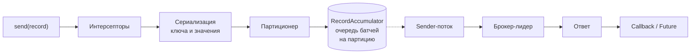

# Модуль 3. Producer API: путь записи от send() до подтверждения

**Время:** 10–12 часов теории и практики
**Первоисточники:**
[Producer Configs](https://kafka.apache.org/documentation/#producerconfigs),
Javadoc `KafkaProducer` (читать целиком — он содержательнее большинства статей),
[KIP-91](https://cwiki.apache.org/confluence/display/KAFKA/KIP-91+Provide+Intuitive+User+Timeouts+in+The+Producer) (delivery.timeout.ms),
[KIP-98](https://cwiki.apache.org/confluence/display/KAFKA/KIP-98+-+Exactly+Once+Delivery+and+Transactional+Messaging) (идемпотентность),
[KIP-679](https://cwiki.apache.org/confluence/display/KAFKA/KIP-679%3A+Producer+will+enable+the+strongest+delivery+guarantee+by+default) (сильные гарантии по умолчанию),
[KIP-1030](https://cwiki.apache.org/confluence/display/KAFKA/KIP-1030%3A+Change+constraints+and+default+values+for+various+configurations) (новые умолчания в 4.0)

---

В модуле 2 вы смотрели на батчи со стороны брокера: как они лежат на диске, почему у них `producerId`, почему шаг индекса равен их размеру. Этот модуль — та же картина со стороны клиента. Откуда берутся батчи, кто решает, когда их отправлять, и что на самом деле означает «сообщение отправлено».

Признак того, что модуль усвоен: вы можете объяснить, почему `retries=Integer.MAX_VALUE` не приводит к вечным ретраям, почему добавление задержки `linger.ms` уменьшает задержку под нагрузкой, и где именно теряется сообщение при `acks=1`.

## Содержание

1. [Путь записи](#1-путь-записи)
2. [Что может заблокировать send()](#2-что-может-заблокировать-send)
3. [Батчинг](#3-батчинг)
4. [Сжатие](#4-сжатие)
5. [acks: что значит «записано»](#5-acks-что-значит-записано)
6. [Таймауты и ретраи](#6-таймауты-и-ретраи)
7. [Порядок и запросы в полёте](#7-порядок-и-запросы-в-полёте)
8. [Идемпотентность](#8-идемпотентность)
9. [Ошибки и callback](#9-ошибки-и-callback)
10. [Размеры сообщений](#10-размеры-сообщений)
11. [Партиционирование, интерсепторы, заголовки](#11-партиционирование-интерсепторы-заголовки)
12. [Жизненный цикл продюсера](#12-жизненный-цикл-продюсера)
13. [Метрики](#13-метрики)
14. [Антипаттерны](#14-антипаттерны)
15. [Контрольные вопросы и гейт](#15-контрольные-вопросы-и-гейт)
16. [F.A.Q.](#16-faq)

---

## 1. Путь записи

Главное, что нужно понять про продюсер: **`send()` ничего не отправляет.** Он кладёт запись в буфер и сразу возвращает управление. Сетью занимается отдельный фоновый поток.



По шагам:

1. **Метаданные.** Чтобы выбрать партицию, продюсер должен знать, сколько их у топика и кто лидер. При первом обращении к топику он запрашивает метаданные и ждёт их — это первое место, где `send()` может блокироваться.
2. **Интерсепторы** (`ProducerInterceptor.onSend`) — могут изменить запись.
3. **Сериализация** ключа и значения в байты. Ошибка сериализации выбрасывается прямо из `send()`, синхронно.
4. **Партиционер** выбирает партицию (модуль 2, раздел 2).
5. **RecordAccumulator** — внутренний буфер. Для каждой партиции своя очередь батчей. Запись дописывается в последний незаполненный батч нужной партиции или открывает новый.
6. **Sender-поток** (`kafka-producer-network-thread`) забирает готовые батчи, группирует их по брокеру-лидеру и отправляет одним запросом на брокер.
7. Брокер отвечает. Sender вызывает **callback** и завершает **Future**.

Из этой схемы следуют почти все настройки модуля: `buffer.memory` и `max.block.ms` — про шаги 1 и 5, `batch.size` и `linger.ms` — про момент, когда батч из шага 5 готов к отправке, `acks`, `retries` и таймауты — про шаги 6 и 7.

Отдельно стоит зафиксировать разницу двух ожиданий, которые складываются в полную задержку записи:

```
задержка записи = время в буфере + время запроса
                   (record-queue-time)  (request-latency)
```

Первое определяется батчингом и загрузкой продюсера, второе — сетью, брокером и репликацией. Метрики для обоих есть (раздел 13), и при разборе медленной записи первым делом нужно понять, какое из двух слагаемых выросло.

### Кто есть кто

Дальше в модуле участники называются так:

| Имя | Что это |
|---|---|
| **поток приложения** | ваш код, вызывающий `send()` |
| **`RecordAccumulator`** | буфер продюсера: для каждой партиции очередь батчей; поток приложения дописывает в конец очереди, Sender-поток забирает из начала |
| **Sender-поток** | единственный фоновый поток продюсера: отправляет запросы, читает ответы, вызывает callback, повторяет |
| **`NetworkClient`** | сетевой слой внутри Sender-потока: соединения с брокерами, таймауты запросов |
| **брокер** | процесс Kafka: сетевые потоки читают запросы из сокетов в очередь запросов, потоки-обработчики их выполняют |

Когда говорят «клиент повторил запрос» или «клиент получил таймаут», речь идёт о Sender-потоке, а не о `send()`: к этому моменту `send()` давно вернул управление.

---

## 2. Что может заблокировать send()

`send()` асинхронный, но не всегда мгновенный. Два места, где он может ждать:

**Метаданные топика неизвестны.** Продюсер ждёт ответа на запрос метаданных. Если топика нет и автосоздание выключено — ждёт до таймаута.

**Буфер полон.** Если Sender не успевает отправлять, `RecordAccumulator` заполняется до `buffer.memory` (по умолчанию 32 МБ), и `send()` блокируется, ожидая освобождения места.

Оба ожидания ограничены одним параметром — `max.block.ms` (по умолчанию 60 секунд). По истечении `send()` возвращает управление с ошибкой, но **не бросает её**: ошибка приходит в callback и в Future. Для нехватки памяти это `BufferExhaustedException`, для метаданных — `TimeoutException` с текстом о том, что топика нет в метаданных.

Важная деталь: такой callback вызывается **в потоке приложения, прямо внутри `send()`**, а не в Sender-потоке. Javadoc метода `send()` при этом описывает `TimeoutException` как исключение, которое метод бросает, — поведение кода расходится с документацией, и проверяется это только экспериментом (лаба 3.7).

Практическое следствие: если брокер недоступен, а приложение пишет быстро, через некоторое время `send()` начнёт блокировать поток приложения — например, поток обработки HTTP-запросов. В сервисе с синхронным API это выглядит как внезапный рост времени ответа. Это не баг Kafka, а обратное давление (backpressure), и его нужно учитывать в дизайне.

---

## 3. Батчинг

Батч — единица отправки и хранения (формат — модуль 2, раздел 3). Продюсер копит записи для одной партиции в батч и отправляет его, когда выполнено одно из условий:

| Условие | Параметр | По умолчанию |
|---|---|---|
| батч заполнен | `batch.size` | 16 384 байт |
| прошло время с первой записи в батче | `linger.ms` | **5 мс** |
| явный `flush()` или `close()` | — | — |

Важное изменение версии: до Kafka 4.0 `linger.ms` по умолчанию был 0, в 4.0 по KIP-1030 он стал 5. Многие статьи и ответы на форумах описывают старое поведение.

`batch.size` — это не «сколько записей», а **сколько байт** на партицию. Запись больше `batch.size` всё равно отправится — одна, в собственном батче.

### Почему задержка уменьшает задержку

Звучит парадоксально, но это центральная идея модуля.

При `linger.ms=0` Sender отправляет батч сразу, как только он появился, даже если в нём одна запись. При низком трафике это даёт минимальную задержку. При высоком — миллионы крошечных запросов.

Каждый запрос чего-то стоит: заголовок, сетевой раунд-трип, поток-обработчик на брокере, запись на диск, репликация. Кроме того, запросов в полёте на одно соединение не больше `max.in.flight.requests.per.connection` (раздел 7). Когда лимит исчерпан, новые записи ждут в буфере, и их время ожидания растёт.

При `linger.ms=5` запись ждёт несколько миллисекунд, но за это время в тот же батч попадают десятки других. Запросов в десятки раз меньше, брокер разгружается, сжатие работает лучше (раздел 4), очередь в буфере не растёт.

Итог: **при низкой нагрузке `linger.ms` добавляет задержку, при высокой — уменьшает.** Точку перелома для своей нагрузки нужно искать замером, это одна из задач практикума.

### Когда linger.ms вообще срабатывает

Батч уходит по тому условию, которое наступит раньше: истёк `linger.ms` или батч заполнился. Время заполнения зависит от потока, который приходит в партицию:

```
время заполнения ≈ batch.size / (записей в секунду в партицию × размер записи)
```

Записи без ключа встроенный партиционер направляет в одну партицию, пока туда не уйдёт около `batch.size` байт (KIP-794), поэтому батч наполняет весь поток продюсера. Записи с ключом делятся между партициями, и каждый батч наполняется во столько раз медленнее, сколько партиций получают записи.

Записи приходят равномерно, поэтому первая запись батча ждёт всё его время жизни, последняя — почти ноль. В среднем ожидание в буфере — половина от меньшего из двух времён. Отсюда три режима:

- **низкая нагрузка:** батч не успевает заполниться, `linger.ms` добавляет в среднем `linger.ms / 2`;
- **средняя нагрузка:** батч заполняется раньше, чем истекает `linger.ms`, и настройка ни на что не влияет;
- **нагрузка у предела:** `linger.ms > 0` сокращает число запросов и снимает очередь за свободными слотами — задержка уменьшается.

### Синхронная отправка и linger.ms

`get()` не ускоряет отправку. Батч с единственной записью не заполнится, поэтому при синхронной отправке каждая запись ждёт в буфере полный `linger.ms` и только потом уходит:

```
пропускная способность синхронной отправки ≈ 1000 / (linger.ms + время запроса, мс) записей в секунду
```

При времени запроса 0,2 мс это около 190 записей в секунду при `linger.ms=5` и около 5000 при `linger.ms=0`. Следствие для обновления: синхронный продюсер после перехода на Kafka 4.0 замедляется в десятки раз без единой правки кода. Для синхронной отправки `linger.ms=0` нужно задавать явно.

### Память

Все батчи всех партиций живут в общем буфере размером `buffer.memory`. Прикиньте: продюсер пишет в 1000 партиций, на каждую держит хотя бы один открытый батч по 16 КБ — это уже 16 МБ из 32. Увеличение `batch.size` при большом числе партиций быстро упирается в этот потолок, и `send()` начинает блокироваться.

---

## 4. Сжатие

`compression.type`: `none` (по умолчанию), `gzip`, `snappy`, `lz4`, `zstd`.

Где что происходит:

- **продюсер** сжимает батч целиком;
- **брокер** хранит батч в сжатом виде и отдаёт как есть;
- **потребитель** распаковывает.

Брокер при этом проверяет батч — CRC и корректность оффсетов, — но не перепаковывает. Это позволяет сохранить zero-copy при отдаче (модуль 1, раздел 5).

**Когда брокер всё-таки перепаковывает.** У топика и у брокера есть своя настройка `compression.type`, по умолчанию `producer` — «хранить как прислал продюсер». Если явно задать на топике другой алгоритм, брокер будет распаковывать и пережимать каждый батч, тратя CPU. Это законный инструмент, но о цене нужно знать.

**Сжатие зависит от батча.** Коэффициент определяется размером и однородностью батча. Сотня похожих JSON-ов сжимается в разы, одна запись — почти никак. Поэтому сжатие и батчинг настраиваются вместе: увеличили `linger.ms` — выросли батчи — выросла степень сжатия.

**Выбор алгоритма** в общих чертах: `lz4` и `snappy` быстрые с умеренной степенью, `zstd` даёт лучшую степень при приемлемой скорости, `gzip` медленный и нужен в основном для совместимости. Уровень сжатия можно настроить отдельно: `compression.gzip.level`, `compression.lz4.level`, `compression.zstd.level`. Но общие характеристики — только ориентир: реальная картина зависит от ваших данных, и её показывает замер.

---

## 5. acks: что значит «записано»

`acks` определяет, какое подтверждение продюсер ждёт от брокера, прежде чем считать запись успешной.

| `acks` | Продюсер ждёт | Где теряется сообщение |
|---|---|---|
| `0` | ничего | где угодно: сеть, брокер, диск. Продюсер даже не узнает об ошибке |
| `1` | записи на лидере | лидер записал, подтвердил, умер до того, как фолловеры скопировали |
| `all` (`-1`) | записи на всех репликах из ISR | только если ISR сжался до одной реплики и она погибла |

По умолчанию с Kafka 3.0 — `all` (KIP-679).

### Где именно теряется при acks=1

Сценарий, который стоит уметь описать по шагам:

1. Продюсер отправляет батч лидеру партиции.
2. Лидер дописывает в свой лог и отвечает «успешно».
3. Продюсер вызывает callback с успехом, приложение считает запись сохранённой.
4. Лидер падает. Фолловеры ещё не успели скопировать батч.
5. Новым лидером становится фолловер — без этого батча.
6. Когда старый лидер возвращается, он **обрезает** свой лог до позиции нового лидера. Батч исчезает окончательно.

Продюсер получил подтверждение записи, которой больше не существует.

Окно потери — время между ответом лидера продюсеру и моментом, когда фолловеры забрали запись. В быстрой сети это доли миллисекунды: фолловеры держат к лидеру постоянный запрос на чтение и получают новые данные сразу. Поэтому потеря редка при исправной сети и частая, когда фолловеры отстают — из-за перегрузки, сетевых задержек или пауз сборщика мусора. В практикуме окно расширяется искусственно.

### acks=all — не магия

`acks=all` означает «все реплики **из ISR**», а не «все реплики вообще». Если ISR сжался до одного лидера (фолловеры отстали или упали), `acks=all` вырождается в `acks=1`.

Защиту от этого даёт настройка **топика или брокера** `min.insync.replicas`: если в ISR меньше реплик, чем это значение, запись с `acks=all` отклоняется с `NotEnoughReplicasException`. Стандартная надёжная конфигурация — `RF=3`, `min.insync.replicas=2`, `acks=all`. Детально — модуль 6.

Отсюда важный вывод: **надёжность записи определяется парой — настройкой продюсера и настройкой топика.** `acks=all` без `min.insync.replicas` защищает хуже, чем кажется.

---

## 6. Таймауты и ретраи

Здесь больше всего путаницы, потому что параметров несколько и они вложены друг в друга.

| Параметр | Что ограничивает | По умолчанию |
|---|---|---|
| `request.timeout.ms` | ожидание ответа на **один** запрос к брокеру | 30 с |
| `retry.backoff.ms` | начальная пауза между попытками | 100 мс |
| `retry.backoff.max.ms` | потолок экспоненциально растущей паузы | 1 с |
| `retries` | число повторов | `Integer.MAX_VALUE` |
| `delivery.timeout.ms` | **всё** время от `send()` до успеха или окончательной ошибки | 120 с |

### delivery.timeout.ms — единственный настоящий предел

До KIP-91 пользователь должен был сам сложить `retries × (request.timeout.ms + retry.backoff.ms)`, чтобы понять, сколько продюсер будет пытаться. Это было неинтуитивно, и KIP-91 ввёл одну верхнюю границу.

Сейчас логика такая: `retries` по умолчанию бесконечен, но это не значит, что продюсер будет пытаться вечно. Он будет повторять, пока не истечёт `delivery.timeout.ms`, после чего callback получит `TimeoutException`.

Отсюда ответ на вопрос из вступления: **`retries=Integer.MAX_VALUE` не приводит к вечным ретраям, потому что время ограничено `delivery.timeout.ms`.** Управлять надёжностью доставки нужно им, а `retries` почти никогда не стоит трогать.

Отсчёт `delivery.timeout.ms` начинается с момента `send()` и включает время ожидания в буфере. Поэтому есть ограничение:

```
delivery.timeout.ms >= linger.ms + request.timeout.ms
```

Если значение задано явно и нарушает это условие, продюсер не создастся с ошибкой конфигурации. Если не задано, клиент сам поднимет его до допустимого и выведет предупреждение в лог.

### Какие ошибки ретраятся

Продюсер повторяет только **ретраибельные** ошибки — те, что могут пройти при следующей попытке: смена лидера (`NOT_LEADER_OR_FOLLOWER`), временная недоступность брокера, таймаут запроса, `NotEnoughReplicasException`.

Не ретраятся ошибки, которые при повторе гарантированно повторятся: `RecordTooLargeException`, ошибки авторизации, несуществующий топик при выключенном автосоздании, ошибка сериализации.

---

## 7. Порядок и запросы в полёте

`max.in.flight.requests.per.connection` (по умолчанию 5) — сколько запросов продюсер может отправить брокеру, не дождавшись ответа на предыдущие.

Лимит действует на каждое соединение отдельно: у продюсера по соединению на каждый брокер, где лежат лидеры нужных ему партиций. Один запрос несёт батчи всех таких партиций — не больше одного батча на партицию и в пределах `max.request.size`.

Больше запросов в полёте — выше пропускная способность, особенно при высокой сетевой задержке. Но появляется риск переупорядочивания.

### Как ломается порядок без идемпотентности

При `enable.idempotence=false`, `retries > 0` и `max.in.flight > 1`:

1. Продюсер отправляет батч A (записи 1–10), затем батч B (11–20) в ту же партицию, не дожидаясь ответа на A.
2. Батч A получает временную ошибку, B записывается успешно.
3. Продюсер повторяет A, и он записывается **после** B.

В логе порядок 11–20, 1–10, хотя приложение отправляло наоборот. Никакой ошибки ни продюсер, ни брокер не видят.

Раньше единственным способом избежать этого было `max.in.flight=1`, что убивало пропускную способность. Идемпотентность решает проблему без этой цены.

---

## 8. Идемпотентность

Включена по умолчанию с Kafka 3.0 (KIP-679): `enable.idempotence=true`.

### Как работает

При старте продюсер получает у брокера **Producer ID** (PID) и **эпоху**. Каждый батч, отправляемый в конкретную партицию, получает **порядковый номер** (sequence number), растущий на единицу.

Брокер помнит для каждой пары (PID, партиция) номера последних **пяти** батчей. Получив батч, он проверяет номер:

- ожидаемый — записывает;
- уже виденный — это дубль от ретрая, подтверждает без повторной записи;
- с разрывом — ошибка `OutOfOrderSequenceException`: что-то потерялось.

Это ровно те поля `producerId`, `producerEpoch`, `baseSequence`, которые вы видели в `kafka-dump-log.sh` в модуле 2.

**Почему именно 5.** Брокер помнит пять последних батчей, поэтому идемпотентность требует `max.in.flight.requests.per.connection ≤ 5`. При этом условии и ретрай, и порядок обрабатываются корректно: повторённый батч с меньшим номером не будет записан после батча с большим.

### Условия

Идемпотентность требует одновременно:

- `acks=all`;
- `retries > 0`;
- `max.in.flight.requests.per.connection ≤ 5`.

Если вы **явно** задали `enable.idempotence=true` и одно из условий нарушено — продюсер не создастся, будет `ConfigException`.

Если вы идемпотентность **не задавали**, а просто поставили, например, `acks=1` — продюсер тихо отключит идемпотентность. Это частая ловушка: разработчик меняет `acks` ради скорости и незаметно теряет защиту от дублей и переупорядочивания.

### Что гарантирует и чего нет

Гарантирует: **в пределах одной сессии продюсера и одной партиции** — никаких дублей от внутренних ретраев и никакого переупорядочивания.

Не гарантирует:

- **при перезапуске продюсера** — новый процесс получит новый PID, и брокер не сможет связать его батчи со старыми. Если приложение после перезапуска переотправит то, что не успело подтвердиться, появятся дубли. Стабильную идентичность между перезапусками даёт `transactional.id` — модуль 6;
- **при повторном вызове `send()` приложением** — если ваш код сам решил переотправить запись после ошибки, это новая запись с новым номером, и брокер запишет её как новую;
- **между партициями** — порядковые номера независимы для каждой партиции.

Брокер не хранит состояние продюсеров вечно: PID, от которого долго нет записей, забывается по истечении `producer.id.expiration.ms` (по умолчанию сутки). Для продюсера, пишущего раз в несколько дней, это означает `UNKNOWN_PRODUCER_ID` при следующей записи — клиент обработает её сам, но это стоит знать при разборе логов.

---

## 9. Ошибки и callback

### Два пути ошибок

**Бросаются из `send()`** — ошибки, которые клиент не относит к ошибкам Kafka: сериализация, некорректные аргументы (например, `IllegalArgumentException`, когда `batch.size` больше `buffer.memory`), закрытый продюсер, прерывание потока.

**Приходят в callback и через `Future.get()`** — все ошибки Kafka, включая обнаруженные ещё внутри `send()`:

- обнаруженные до попадания в буфер: таймаут по `max.block.ms` (`BufferExhaustedException`, `TimeoutException` по метаданным), `RecordTooLargeException`. Callback для них вызывается в потоке приложения, внутри `send()`;
- случившиеся после попадания в буфер: таймаут доставки, отказ авторизации, исчерпанные ретраи. Callback вызывается в Sender-потоке.

Правило простое: всё, что наследует `ApiException`, клиент перехватывает внутри `send()` и отдаёт через callback.

Код, который ловит только исключения из `send()` и не смотрит на callback, пропускает большую часть ошибок. Если callback не передан и Future не проверяется — ошибка доставки теряется молча. Это одна из самых частых причин «потерянных» сообщений в продакшене, и Kafka здесь ни при чём.

### Где выполняется callback

Для ошибок, обнаруженных внутри `send()`, callback вызывается в потоке приложения (см. выше). Во всех остальных случаях — успешная запись, ошибки доставки — callback вызывается **в Sender-потоке**, том же, который отправляет данные для всех партиций. Отсюда правило: **в callback нельзя делать ничего медленного.** Ни синхронных запросов в базу, ни HTTP-вызовов, ни тяжёлых вычислений. Заблокированный callback блокирует всю отправку продюсера.

Если по результату записи нужна тяжёлая работа, callback должен лишь передать её в отдельный пул потоков. Но у выноса есть две ловушки:

- **Неограниченная очередь пула разрывает обратное давление.** Без выноса цепочка работает сама: медленный callback → Sender-поток медленнее забирает батчи → буфер заполняется → `send()` блокирует поток приложения. С неограниченной очередью Sender-поток мгновенно свободен, приложение не замедляется, очередь растёт до исчерпания памяти, а метрики Kafka показывают норму. Нужна ограниченная очередь, которая при переполнении выполняет задачу в вызывающем потоке — в Java это `ArrayBlockingQueue` с `ThreadPoolExecutor.CallerRunsPolicy`. Размер очереди пула — отдельная метрика.
- **Запись подтверждена раньше, чем выполнена работа по ней.** При падении процесса задачи из очереди пропадают, хотя записи уже в топике.

Внутри одной партиции callback'и вызываются в порядке отправки.

### Три способа отправки

| Способ | Код | Цена |
|---|---|---|
| fire-and-forget | `send(record)` | ошибки доставки не видны |
| асинхронно с callback | `send(record, callback)` | нужна аккуратная обработка ошибок |
| синхронно | `send(record).get()` | каждый вызов ждёт `linger.ms` и подтверждения, батчинг не работает |

Синхронная отправка по одному сообщению — ловушка. Каждый `get()` ждёт `linger.ms` и полного раунд-трипа (раздел 3), в буфере никогда не бывает больше одной записи, и пропускная способность падает на порядки. Замер этого эффекта — первое задание практикума, код в `labs/lab03-producer`.

---

## 10. Размеры сообщений

Три лимита, которые должны быть согласованы:

| Где | Параметр | По умолчанию |
|---|---|---|
| продюсер | `max.request.size` | 1 МБ |
| брокер | `message.max.bytes` | около 1 МБ |
| топик | `max.message.bytes` | наследует брокерский |

`max.request.size` ограничивает и размер одной записи, и размер запроса целиком. Все три лимита применяются к **батчу**, а при сжатии — к сжатому батчу.

Запись больше лимита даёт `RecordTooLargeException`, которая не ретраится.

Если нужно передавать крупные объекты — изображения, документы, — стандартное решение не поднимать лимиты, а хранить объект во внешнем хранилище и передавать в Kafka ссылку (паттерн claim check). Большие сообщения ухудшают батчинг, увеличивают задержку для всех остальных и нагружают память брокера и потребителей.

---

## 11. Партиционирование, интерсепторы, заголовки

**Партиционирование** разобрано в модуле 2. Здесь только параметры продюсера, влияющие на встроенный алгоритм (KIP-794):

- `partitioner.class` — свой класс; если не задан, используется встроенный;
- `partitioner.ignore.keys` — игнорировать ключи при выборе партиции;
- `partitioner.adaptive.partitioning.enable` — учитывать скорость брокеров при записи без ключа;
- `partitioner.availability.timeout.ms` — через сколько не отвечающий брокер исключается из выбора.

Свой партиционер — пример в `labs/lab03-producer/TenantPartitioner.java`. Заменяя встроенный, вы берёте на себя три вещи:

- **Партиционер становится частью контракта топика.** Один ключ у разных алгоритмов попадает в разные партиции. Если в топик пишут два сервиса с разными партиционерами, порядок по ключу не гарантирован, а смена параметров партиционера требует одновременной остановки всех продюсеров.
- **Записи без ключа теряют встроенные механизмы:** удержание потока в одной партиции до заполнения батча и обход медленных брокеров. Батчи мельче, медленный брокер продолжает получать записи.
- **Изоляция трафика фиксирует мощность.** Выделенные партиции не растут вместе со всплеском своего трафика.

Изоляцию трафика почти всегда дешевле делать отдельным топиком: у него своё число партиций, свой retention, свои потребители, и он масштабируется независимо. Свой партиционер оправдан, когда нужна особая раскладка внутри одного топика и все его продюсеры контролирует одна команда.

**Конфигурация плагинов.** Продюсер передаёт в `configure()` каждого плагина — сериализаторов, интерсепторов, партиционера — все настройки, которые получил, включая неизвестные ему. Так плагин получает собственную конфигурацию: её кладут рядом с настройками продюсера. Клиент отслеживает, какие из переданных настроек кто-то прочитал, и при старте сообщает только о непрочитанных. Следствие: опечатка в имени настройки плагина не вызывает ошибку, плагин молча получит значение по умолчанию. Настройки плагина стоит проверять в самом `configure()`.

**Интерсепторы** (`interceptor.classes`) — цепочка `ProducerInterceptor`, вызываемая перед сериализацией (`onSend`) и при получении подтверждения (`onAcknowledgement`). Применения: трассировка, метрики, аудит. Ограничения те же, что у callback: `onAcknowledgement` выполняется в Sender-потоке, в нём нельзя блокироваться.

**Заголовки** — пары ключ-значение в записи (модуль 2, раздел 3). Штатное место для идентификатора трассировки, версии схемы, источника события. В отличие от ключа, не влияют на партиционирование.

---

## 12. Жизненный цикл продюсера

**Один продюсер на приложение.** `KafkaProducer` потокобезопасен и рассчитан на то, чтобы его разделяли потоки. Создание продюсера — дорогая операция: соединения, метаданные, Sender-поток, получение PID. Продюсер на каждый запрос — известный антипаттерн, который выглядит как утечка соединений и медленная запись.

Несколько продюсеров оправданы, когда нужны принципиально разные настройки — например, один с `acks=all` для важных событий и другой с `acks=1` для телеметрии — или отдельные транзакционные продюсеры (модуль 6).

**`flush()`** блокирует вызывающий поток, пока все записи в буфере не будут отправлены и подтверждены. Полезен перед контрольной точкой приложения. В цикле после каждого `send()` превращает асинхронный продюсер в синхронный.

**`close()`** ждёт отправки всех буферизованных записей. `close(Duration.ZERO)` закрывает немедленно, выбрасывая недоставленное. При остановке приложения продюсер нужно закрывать явно — иначе записи из буфера теряются.

---

## 13. Метрики

Продюсер публикует метрики через JMX и через `producer.metrics()`. Минимальный набор, который нужно понимать:

| Метрика | Что показывает |
|---|---|
| `record-send-rate` | записей в секунду |
| `record-error-rate` | ошибок доставки в секунду — должно быть ноль |
| `record-retry-rate` | ретраев в секунду — рост означает проблемы на брокерах |
| `request-latency-avg` | время запроса к брокеру |
| `record-queue-time-avg` | время ожидания записи в буфере |
| `batch-size-avg` | средний размер батча в байтах |
| `records-per-request-avg` | записей на запрос — показатель эффективности батчинга |
| `compression-rate-avg` | отношение сжатого размера к исходному |
| `buffer-available-bytes` | свободная память буфера |
| `bufferpool-wait-time-ns-total` | сколько потоки ждали места в буфере, в наносекундах |

Диагностика медленной записи начинается с разделения из раздела 1: выросло `record-queue-time` — проблема в продюсере (мелкие батчи, полный буфер, лимит запросов в полёте), выросло `request-latency` — проблема на брокере или в сети.

Оговорка: `request-latency` фиксируется в момент, когда Sender-поток **обработал** ответ, а не когда ответ пришёл. Если Sender-поток занят — например, медленными callback'ами, — пришедшие ответы лежат в сокете непрочитанными, и метрика растёт без всякой проблемы на брокере. Прежде чем искать причину на брокере, проверьте, чем занят Sender-поток.

---

## 14. Антипаттерны

| Антипаттерн | Почему плохо |
|---|---|
| `send().get()` на каждое сообщение | батчинг не работает, каждый вызов ждёт `linger.ms`; пропускная способность падает на порядки |
| продюсер на каждый запрос | дорогое создание, утечка соединений, нет батчинга |
| отправка без callback и без проверки Future | ошибки доставки теряются молча |
| медленная работа в callback | блокирует отправку для всех партиций |
| вынос работы из callback в неограниченную очередь | обратное давление пропадает, очередь растёт до исчерпания памяти |
| `acks=all` без `min.insync.replicas` на топике | защита вырождается в `acks=1` при сжатии ISR |
| смена `acks` без явного `enable.idempotence` | идемпотентность тихо отключается |
| ручной повтор `send()` при ошибке | создаёт дубли, которые идемпотентность не ловит |
| повышение лимитов под большие объекты | ухудшает работу всего кластера; нужен claim check |
| отсутствие `close()` при остановке | записи из буфера теряются |
| свой партиционер для изоляции трафика | фиксирует мощность, ломает совместимость по ключам; нужен отдельный топик |

---

## 15. Контрольные вопросы и гейт

### Вопросы

1. Опишите путь записи от вызова `send()` до срабатывания callback. В каком потоке выполняется каждый шаг?
2. В каких двух случаях `send()` блокирует вызывающий поток и что происходит по истечении `max.block.ms`?
3. Почему увеличение `linger.ms` может уменьшить задержку записи под нагрузкой? Опишите механизм.
4. Опишите по шагам, как теряется подтверждённое сообщение при `acks=1`.
5. Почему `acks=all` без `min.insync.replicas` защищает хуже, чем кажется?
6. Почему `retries=Integer.MAX_VALUE` не приводит к вечным ретраям? Какой параметр на самом деле ограничивает доставку?
7. Как возникает переупорядочивание записей без идемпотентности? Почему идемпотентность требует `max.in.flight ≤ 5`?
8. Что гарантирует идемпотентный продюсер при перезапуске приложения? А при ручном повторе `send()`?
9. Что произойдёт с идемпотентностью, если в конфигурации без явного `enable.idempotence` поставить `acks=1`?
10. Почему в callback нельзя делать синхронный запрос в базу?
11. По каким двум метрикам вы определите, где проблема медленной записи — в продюсере или на брокере?

### Гейт закрытия модуля

**Самопроверка без материалов.** Письменные ответы на одиннадцать вопросов, не открывая ни документацию, ни этот файл.

**Артефакт с обоснованием.** `notes/03-producer.md` и `benchmarks/` закоммичены и содержат:

- таблицу замеров для трёх режимов отправки и матрицу `acks × linger.ms × compression.type` с колонкой «почему так»;
- найденную точку, в которой `linger.ms` начинает уменьшать задержку, для вашей нагрузки;
- раздел «почему так устроено»: буфер и Sender-поток, `delivery.timeout.ms`, идемпотентность.

**Сценарии поломки.** Задокументированы минимум четыре:

- потеря подтверждённых записей при `acks=1` и убийстве лидера;
- блокировка `send()` и `TimeoutException` при недоступном брокере и заполненном буфере;
- истечение `delivery.timeout.ms` и потеря записей при отправке без callback;
- тихое отключение идемпотентности при смене `acks`.

---

## 16. F.A.Q.

Вопросы, возникшие при прохождении модуля и не покрытые разделами выше. Где ответ опирается на теорию, дана ссылка на раздел.

### Что будет, если buffer.memory меньше batch.size? А если запись больше buffer.memory?

Это два разных случая.

**Запись крупнее лимита.** Клиент проверяет размер записи до того, как положить её в буфер: сначала против `max.request.size`, потом против `buffer.memory`. Не прошла — `RecordTooLargeException`, без ретраев. Ошибка обнаружена внутри `send()`, но приходит через callback и Future (раздел 9). При настройках по умолчанию до проверки `buffer.memory` дело не доходит: `max.request.size` (1 МБ) меньше буфера (32 МБ).

**Записи маленькие, но `batch.size` больше `buffer.memory`.** Память под новый батч выделяется размером с больший из двух — `batch.size` или размер записи. Выделить больше, чем весь буфер, нельзя, и `send()` бросает `IllegalArgumentException` — синхронно, потому что это не ошибка Kafka. Продюсер при этом создаётся нормально, ошибку получает каждая запись. Проверено в лабе 3.7.

**Пограничный случай важнее на практике.** Если `batch.size` чуть меньше `buffer.memory`, в буфер помещается один-два батча на весь продюсер, а открытый батч нужен каждой партиции. `send()` почти всё время ждёт памяти. Ориентир: `buffer.memory` много больше, чем `batch.size`, умноженный на число партиций, в которые продюсер пишет одновременно.

Буфер переиспользует только блоки размером ровно `batch.size`. Батч под запись крупнее `batch.size` выделяется отдельно и после отправки уходит сборщику мусора, поэтому поток записей чуть больше `batch.size` заметно нагружает GC.

### Когда полезен max.in.flight больше 1 и действует ли он только на один продюсер?

Лимит действует на одно соединение продюсера с одним брокером (раздел 7). Другие продюсеры его не делят.

Польза — конвейеризация, когда время ответа велико. При одном запросе в полёте:

```
пропускная способность ≤ объём запроса / время ответа
```

Межрегиональная связь с задержкой 50 мс и `acks=all` с ожиданием реплик дают около 70 мс на ответ — не больше 14 запросов в секунду на брокер, как бы быстро ни работали сеть и диски. Пять запросов в полёте поднимают потолок в пять раз.

При идемпотентности значение 5 ничего не стоит — порядок сохраняется (раздел 8). Ставить 1 имеет смысл, только когда идемпотентность выключена, а порядок важен.

### max.in.flight — это число Sender-потоков?

Нет. Sender-поток у продюсера всегда один. Лимит ограничивает число запросов, которые отправлены, но ответ на которые ещё не пришёл.

Один поток справляется благодаря неблокирующему вводу-выводу: отправил запрос и, не дожидаясь ответа, собирает и отправляет следующий, проверяет пришедшие ответы. Ожидание занимает не поток, а слот в лимите. Это конвейер, а не параллельная обработка:

```
max.in.flight=1:  R1 ═══════╗ R2 ═══════╗ R3 ═══════╗
                        ответ R1   ответ R2   ответ R3
max.in.flight=3:  R1 ═══════╗
                    R2 ═══════╗
                      R3 ═══════╗
```

Лимит на соединение: при трёх брокерах в полёте может быть до 15 запросов, и всё это обслуживает один поток. Этот же поток вызывает callback, поэтому медленный callback останавливает всё (раздел 9).

### Нет ли голодания при идемпотентности: брокер ждёт пропущенный батч, а остальные отбрасывает?

Брокер никогда не ждёт. Работают три механизма:

- **Брокер обрабатывает запросы одного соединения строго по очереди:** приняв запрос, он не читает соединение, пока не отправит ответ. Сеть сама батчи не переставляет; разрыв в номерах возникает только при ошибке запроса.
- **Батч с разрывом отклоняется сразу** ошибкой `OUT_OF_ORDER_SEQUENCE_NUMBER`. Брокер ничего не буферизует.
- **Порядок восстанавливает клиент.** Батчи на повтор Sender-поток вставляет в очередь партиции по номерам последовательности и на время восстановления отправляет в партицию только первый неподтверждённый батч.

Если пропущенный батч так и не дошёл, он истекает по `delivery.timeout.ms`; приложение получает ошибку по нему и батчам за ним, продюсер повышает эпоху, сбрасывает номера для партиции (KIP-360), и запись продолжается. Цена — всплеск задержки в одной партиции, а не вечная блокировка.

### Почему идемпотентность несовместима с acks=1? Перестанет ли брокер принимать записи?

Состояние продюсера на брокере — последние номера последовательности — восстанавливается из лога. Если батч не реплицирован, вместе с ним пропадает и память о нём:

1. Лидер записал батч N и при `acks=1` подтвердил, не дожидаясь фолловеров.
2. Лидер упал; новый лидер батча N не получил, последний известный ему номер — N−1.
3. Продюсер отправляет N+1; новый лидер видит разрыв — `OutOfOrderSequenceException`.

Батч N потерян при подтверждённой записи — обещание идемпотентности нарушено при первой смене лидера. Kafka предпочитает запретить комбинацию, а не давать видимость гарантии. При `acks=all` подтверждённый батч есть на всех репликах ISR, и новый лидер знает его номер.

Брокер записи принимать не перестанет. До версии 2.5 эта ошибка была фатальной для продюсера. С KIP-360 продюсер повышает эпоху, сбрасывает номера и продолжает работу — но батч N не вернуть. При `acks=0` идемпотентность невозможна вовсе: ответа нет, и продюсер не узнает ни о приёме, ни о разрыве.

### Как продюсер держит пропускную способность при max.in.flight=1 и где предел?

```
записей в секунду = записей на запрос × запросов в секунду
```

При `max.in.flight=1` запросов в секунду меньше, но пока Sender-поток ждёт ответа, батчи становятся готовыми в большем числе партиций, и следующий запрос забирает их все. Растёт объём данных в запросе, причём в основном за счёт числа батчей, а не их размера: батчи и так у потолка `batch.size`. В лабе 3.3 это стоило 11% пропускной способности и вчетверо большей задержки — записи дольше ждут свободного слота.

Предел — объём одного запроса:

```
данных в запросе ≤ число партиций на брокере × batch.size   (и не больше max.request.size)
пропускная способность ≤ данных в запросе / время ответа
```

| Время ответа | Предел при 6 партициях × 16 КБ ≈ 96 КБ |
|---|---|
| 0,3 мс (локальный стенд) | ~320 МБ/с |
| 50 мс (межрегиональная сеть) | ~1,9 МБ/с |

На локальном стенде предел выше, чем способен выдать генератор, поэтому отказ от конвейера почти незаметен. На топике с одной партицией компенсировать нечем — один батч на запрос.

Буфер — не предел, а место, где копится разница между входом и выходом. Упёрся выход в предел — буфер заполняется, и `send()` начинает блокировать поток приложения (раздел 2).

### Где находятся запросы, пока брокер не отвечает, и как Sender-поток повторяет, пока приложение продолжает писать?

Отправленный запрос, на который брокер не ответил, может быть в одном из двух мест:

- **в очереди запросов брокера** — если сетевой поток брокера успел прочитать его из сокета;
- **в буфере приёма сокета в ядре ОС** — если не успел. Ядро принимает байты по TCP, даже когда процесс брокера стоит.

Когда брокер оживёт, он обработает эти запросы и запишет батчи — даже если Sender-поток уже закрыл соединение и отправил повтор. Отсюда дубли без идемпотентности (лаба 3.6) и «ошибка есть, а запись в топике» (лаба 3.8).

Повторы и новые записи друг другу не мешают. Память батча не освобождается до окончательного результата. По таймауту `NetworkClient` закрывает соединение, Sender-поток возвращает батчи **в начало** очереди партиции, переподключается и отправляет их снова. Поток приложения всё это время дописывает новые батчи **в конец** очереди. Полный буфер заблокировал бы поток приложения в `send()`, но не Sender-поток.

Без идемпотентности батчи возвращаются в начало очереди по одному, и порядок повторов может отличаться от исходного. С идемпотентностью клиент вставляет повторы по номерам последовательности.

### Когда синхронная отправка оправдана?

Критерий — не нагрузка, а зависимость: **следующий шаг зависит от подтверждения этой записи.** Например, ответить на HTTP-запрос только после того, как событие надёжно записано.

Второе условие — нагрузка должна укладываться в потолок последовательной отправки: одна запись за полный цикл, `1000 / (linger.ms + время запроса)` записей в секунду на поток (раздел 3). В реальном кластере с `acks=all` цикл занимает 1–3 мс — 300–1000 записей в секунду на поток. 50 заказов в секунду — укладываются; 10 000 событий кликов — нет.

В веб-сервисе каждый запрос обрабатывает свой поток, продюсер общий, и записи разных потоков попадают в одни батчи. Общий потолок примерно равен числу потоков, умноженному на потолок одного, но задержка каждого отдельного запроса — полный цикл. И `linger.ms=0` обязателен.

---

## Дальше

Практикум модуля 3: замер режимов отправки, матрица настроек, поиск точки перелома `linger.ms`, потеря данных при `acks=1` на кластере, заполнение буфера и истечение таймаута доставки.
