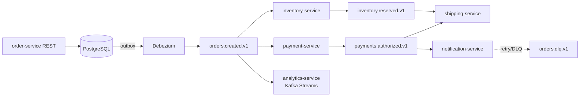

# order-platform

Финальный проект 1: событийная платформа обработки заказов.

Этот каталог — заготовка. Когда проект начнёт занимать больше пары модулей, вынесите его в отдельный репозиторий: он должен читаться как самостоятельная работа, а не как приложение к учебному монорепо.

## Целевая архитектура



## Структура

```
order-platform/
├── docs/
│   ├── adr/                 # архитектурные решения
│   ├── topics.md            # каталог топиков
│   ├── failure-modes.md     # что происходит при отказе каждого компонента
│   └── saga.md              # happy path и компенсации
├── services/
│   ├── order-service/
│   ├── payment-service/
│   ├── inventory-service/
│   ├── shipping-service/
│   ├── notification-service/
│   └── analytics-service/
├── schemas/                 # Avro-схемы, версионируются вместе с кодом
├── connect/                 # конфиги Debezium и sink-коннекторов
├── docker/
└── docker-compose.yml
```

## Каталог топиков

Заполняется по мере проектирования. Формат обязателен — это контракт между сервисами.

| Топик | Ключ | Схема | Партиции | RF | Retention | Producer | Consumers |
|---|---|---|---|---|---|---|---|
| `orders.created.v1` | orderId | OrderCreated.avsc | 12 | 3 | 7d | order-service (via outbox) | payment, inventory, analytics |
| `payments.authorized.v1` | orderId | | 12 | 3 | 7d | payment-service | shipping, notification |
| `inventory.reserved.v1` | orderId | | 12 | 3 | 7d | inventory-service | shipping |
| `orders.dlq.v1` | orderId | | 3 | 3 | 14d | все консьюмеры | dlq-processor |

## Definition of Done

Технические требования:

- [ ] Kafka 4.x в KRaft, RF=3, `min.insync.replicas=2`, `acks=all` у всех producer'ов
- [ ] Transactional Outbox через Debezium + Outbox Event Router (никаких прямых записей в Kafka из бизнес-транзакции)
- [ ] Avro + Schema Registry, режим BACKWARD, проверка совместимости в CI
- [ ] Saga-хореография с компенсирующими транзакциями
- [ ] Идемпотентные потребители с дедупликацией по ключу идемпотентности
- [ ] `exactly_once_v2` в analytics-service
- [ ] Retry-топики с нарастающей задержкой + DLQ + процесс разбора DLQ
- [ ] TLS + SASL/SCRAM + ACL с минимальными правами на каждый сервис
- [ ] Prometheus + Grafana, дашборд с lag по каждой группе, алерты
- [ ] Интеграционные тесты на Testcontainers, юнит-тесты топологии
- [ ] `docker compose up` поднимает всё одной командой
- [ ] CI: сборка, тесты, проверка схем, линтеры

Документация:

- [ ] README с диаграммой архитектуры и демо-сценарием
- [ ] ADR по ключевым решениям (почему outbox, почему Avro, выбор ключей и retention)
- [ ] Раздел «Failure modes»
- [ ] Раздел «Что намеренно не сделано и почему»

## Первые шаги

1. Спроектировать событийную модель на бумаге до написания кода: список событий, их владельцы, ключи, схемы.
2. Написать ADR-001 «Выбор Outbox вместо dual write» — до реализации, а не после.
3. Поднять инфраструктуру (Kafka + Postgres + Debezium + Schema Registry) и убедиться, что CDC работает на пустой таблице.
4. Реализовать order-service и убедиться, что событие доезжает до топика.
5. Дальше — по одному сервису за раз, каждый с тестами.
